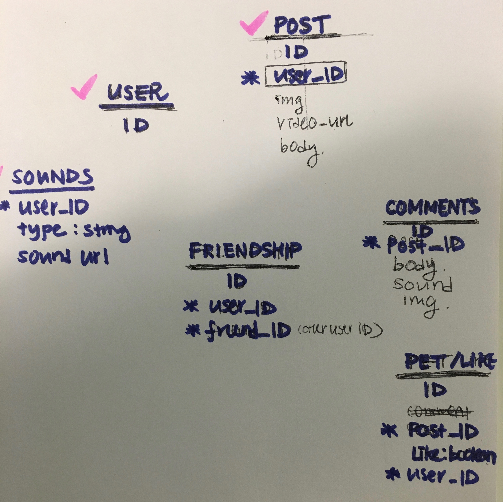
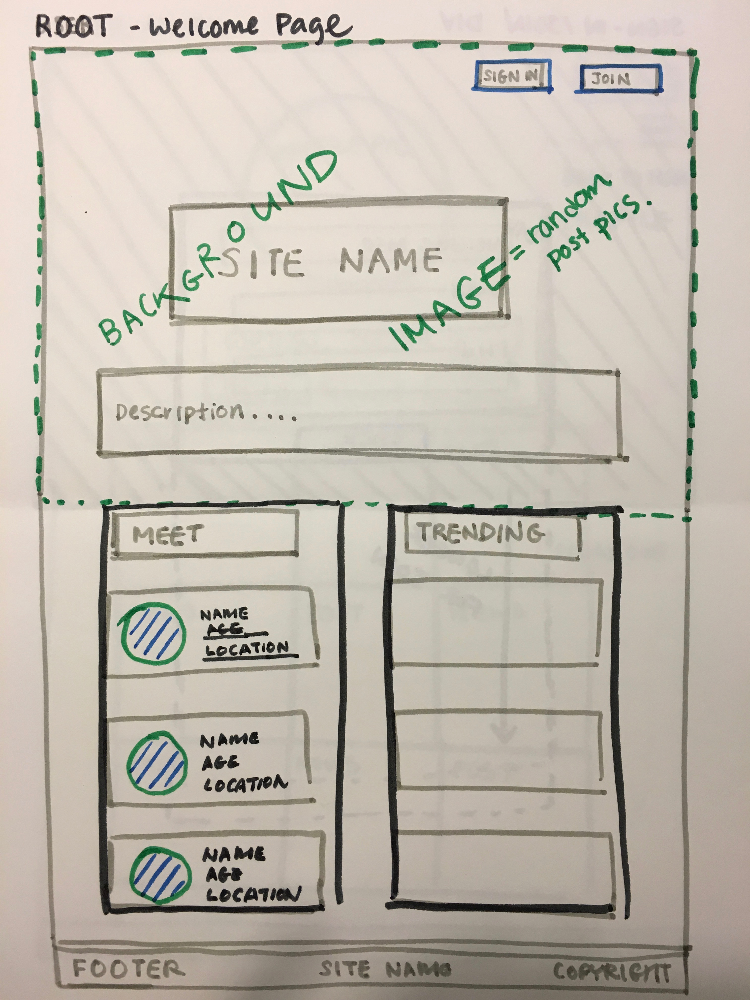
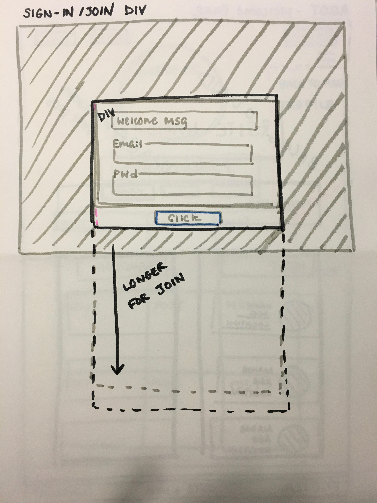
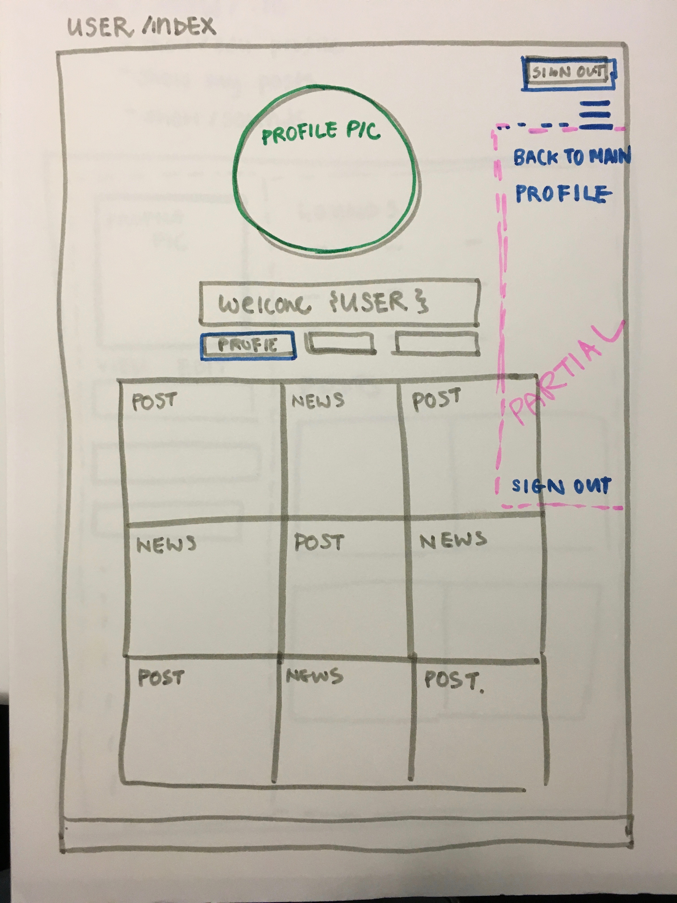

Application Name: "Petssup"
Heroku Link: https://petssup.herokuapp.com/
Trello: https://trello.com/b/GpQor4Cb/project-2
GitHub: https://github.com/labaikie/project-2
API Acceess Point: http://petssup.herokuapp.com/api/posts

1. Introduction
    - "Petssup" is a social network for pets, by pets.
    - Pets can borrow their human's email address to sign up.
    - Once logged-in, pets can update their profile, post blurbs, images, videos, as well as their voices.
    - They can use the uploaded voices to leave comments on others' posts.
    - "Petssup" also allows pets to search for other pets.
    - Recent pets news are provided for their viewing through the Guardian News API.

2. Technologies & Approach
    - This full-stack app is developed with Ruby on Rails.
    - It utilizes PostgreSQL as its database.
    - Javascript and JQuery were used to create modals, as well as user-responsive CSS styling.
    - Four models have been created and are CRUDible (User, Post, Comment, Sound).
    - The app is RESTful.
    - The app also has an API access point; post data are accessible externally.

3. Unsolved Problems
    - The app currently does not allow users to befriend other users
    - Pet type selection is not optimized
    - Needs pagination
    - Setting playdates, events for pets is currently unavailable

[Database Modeling]

[Wire Frames]

Developer: La Baik

